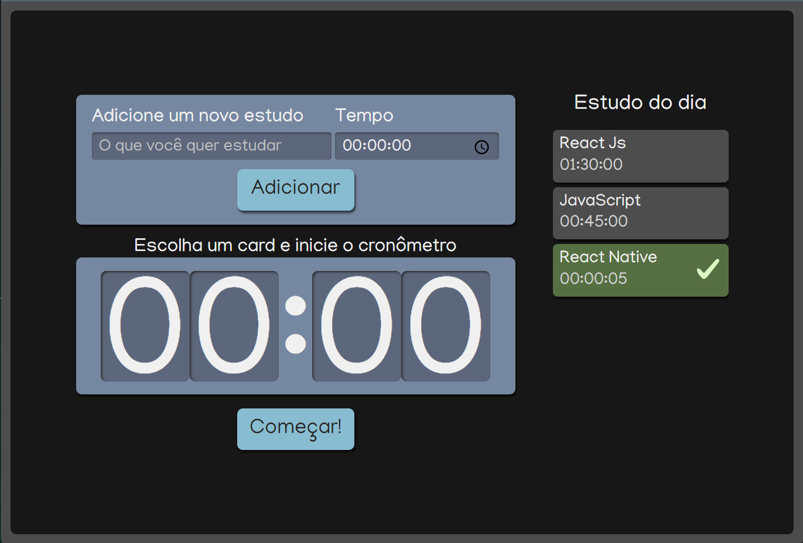
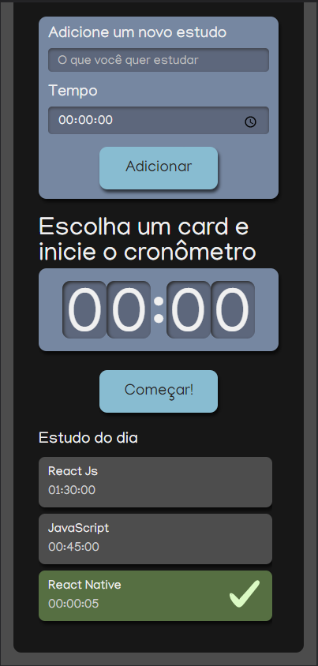

<h1 align="center">Alura Studies Stopwatch</h1>

<br />

<p align="center">
  
</p>

<br />

## Descrição

Projeto feito em ReactJs, onde você pode escolher a atividade que vai fazer, e passar o tempo para cada uma, clique em começar e o cronômetro ira começar a diminuir.

<p align="center">
  
</p>

<p>-------------</p>

<p align="center">
  
</p>

<p>-------------</p>

  - Projeto com deploy na Netlify [clique aqui](https://peppy-queijadas-c25a64.netlify.app/)

## 🚀 Instalação

Clone o projeto na sua máquina, abra o terminal e execute.

```bash
$ git clone https://github.com/ramomOliveira/dtMoney.git
$ cd vh
$ code .
```


Para iniciá-lo, veja uma opção abaixo:

```bash
#instalar as dependências
$ yarn 


#iniciar o projeto
$ yarn start #para rodar em desenvolvimento
```

</br>

## 🧪 Tecnologias

| Tecnologia            | Versão            |
| --------------------- | ----------------- |
| Sass                  | `1.53.0`          |
| Uuid                  | `8.3.2`           |
| ReactJs               | `18.2.0 `         |
| Typescript            | `4.4.2`           |

<br />


- Obs: O projeto simples mais de grande aprendizado.